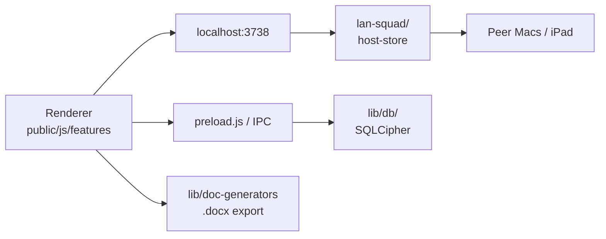

# R+ Documentation Hub

**Agent entry point:** Read this file, then [01-vision-north-star.md](./01-vision-north-star.md) for product trade-offs. For code locations, prefer `.cursor/rules/project-context.mdc` (always-on).

## Product principles (summary)

| Principle | One line |
|-----------|----------|
| North Star | Paste SOME → structured labs → `.docx` note in minimum TTD |
| Ideal user | R1/R2 on 24h high-intensity guardia |
| Architecture | Local-first Electron + LAN LiveSync (:3738), no cloud PHI |
| Scope | Adjunct documentation tool — **not** institutional EMR |

## Architecture (data flow)

## Core documents (`docs/core/`)

| # | Document | Status | Purpose |
|---|----------|--------|---------|
| 00 | [system-index](./00-system-index.md) | stable | This hub |
| 01 | [vision-north-star](./01-vision-north-star.md) | stable | Strategy, trade-offs, anti-goals |
| 02 | [product-context](./02-product-context.md) | stable | Personas, domain, horizons |
| 03 | [user-journey](./03-user-journey.md) | stable | Happy-path workflows |
| 04 | [directory-structure](./04-directory-structure.md) | stable | Where every file type lives |
| 06 | [design-system](./06-design-system.md) | stable | UI tokens (→ `design.md`) |
| 08 | [core-architecture](./08-core-architecture.md) | stable | Electron, LAN, DB, sync |
| 15 | [security](./15-security.md) | stable | LAN + clinical safety perimeter |
| 16 | [glossary-of-terms](./16-glossary-of-terms.md) | in-progress | Domain lexicon |
| 17 | [docs-blueprint](./17-docs-blueprint.md) | stable | Documentation standard |
| 18 | [knowledge-capture](./18-knowledge-capture.md) | stable | Decision log |

*Slots 05, 07, 09–14: placeholders created (see directory).*

## Category indices (spokes)

| Index | Path | Covers |
|-------|------|--------|
| Features | [features/features-index.md](../features/features-index.md) | User-facing domains → code |
| Logic | [logic/logic-index.md](../logic/logic-index.md) | Parsers, sync engines, generators |
| Database | [database/database-index.md](../database/database-index.md) | SQLCipher schema & migrations |
| Plans & specs | `docs/superpowers/` | Design before large features (user-managed) |
| Agent changelog | [logs/agent-changelog.md](../logs/agent-changelog.md) | Doc/integration audit trail |
| API Reference | [api/README.md](../api/README.md) | HTTP + IPC endpoints |

## Read order for new agents

1. [01-vision-north-star.md](./01-vision-north-star.md) — *should we build this?*
2. `.cursor/rules/project-context.mdc` — *where is the code?*
3. [04-directory-structure.md](./04-directory-structure.md) — *where do I put new files?*
4. Relevant category index + `docs/superpowers/specs/` if touching a large feature

## User-facing docs

- [README.md](../../README.md) — install, releases, features list (with ToC)
- [CHANGELOG.md](../../CHANGELOG.md) — full release history
- [CONTRIBUTING.md](../../CONTRIBUTING.md) — contribution guide
- [design.md](../../design.md) — Hallmark design system (source of truth for UI)
