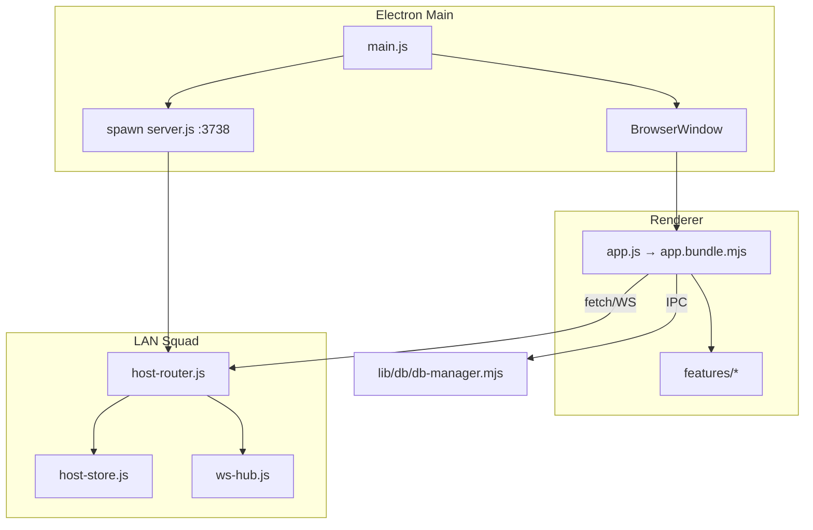

# Core Architecture

## Process model

## Layers

| Layer | Entry | Responsibility |
|-------|-------|----------------|
| Main | `main.js` | Window, updater, IPC, spawn LAN server |
| Preload | `preload.js` | `window.electronAPI` surface |
| LAN server | `server.js` | Express routes, interno mobile, doc export |
| Renderer | `public/js/app.js` | Feature registration via `app-runtimes.mjs` |
| Host sync | `lan-squad/` | Bundle merge, conflict LWW, auth, write queue |
| Clinical DB | `lib/db/` | SQLCipher schema v14, Argon2, outbox |

## LiveSync sync strategy (7.x)

1. **Typed mutations** — HTTP PUT for note, labs, HC, clinical-ops, commands
2. **Delta-first** — revision hints → delta log before full bundle
3. **Safety bundle** — periodic `entriesPartial` (~30s) for untyped paths
4. **Transport fallback** — WS → SSE → HTTP polling
5. **Conflict policy** — LWW on overlap ([spec](../superpowers/specs/2026-06-03-lan-conflict-lww-design.md))

## Document pipeline

`document-export-client.mjs` → `lib/doc-export-http.js` → `lib/doc-generators/{note,indicaciones,listado}.js` (JSZip `.docx`).

## Related

- [database/database-index.md](../database/database-index.md)
- [logic/logic-index.md](../logic/logic-index.md)
- [15-security.md](./15-security.md)
